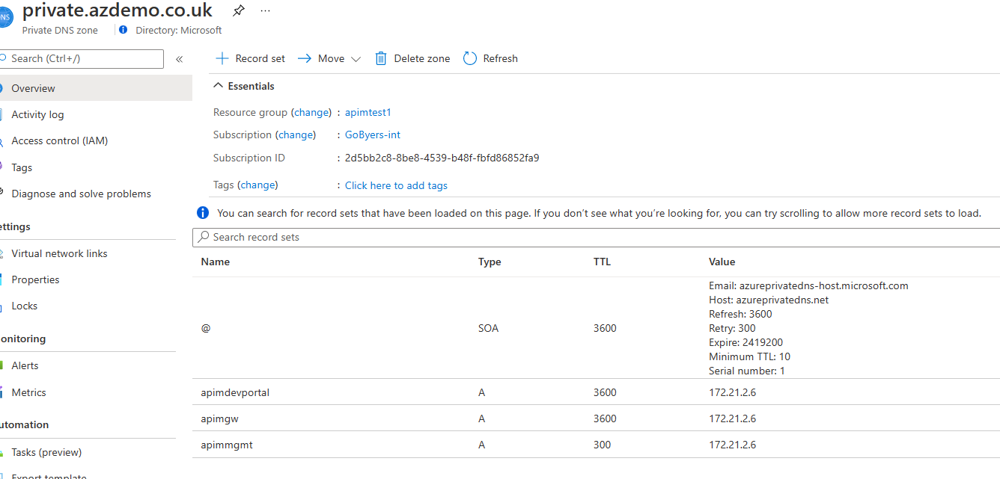

# APIM arm templates

## Internal Mode with PIP - process

These are the steps that i've taken to stand up a new APIM instance in bicep code. Verbosity is deliberate, to facilitate understanding of the approach.

I edit the Bicep files in VSCode, using the [bicep extension](https://marketplace.visualstudio.com/items?itemName=ms-azuretools.vscode-bicep) for intellisense and error assistance.

- Start with identifying a good base template, from [Quick start ARM Templates](https://github.com/Azure/azure-quickstart-templates/blob/master/quickstarts/microsoft.apimanagement/api-management-create-with-internal-vnet-publicip/azuredeploy.json)
- [Decompiled](https://docs.microsoft.com/en-us/azure/azure-resource-manager/bicep/bicep-cli#decompile) ARM template to bicep
- Fixed any bicep language warnings (15 bool->string property conversion)
- Removed vnet/subnet creation, instead target an existing vnet (added a new Vnet RGName parameter to facilitate) to better represent a real world environment
- Changed default parameter values; SKU (developer) and Instance size (1) for cost optimisation
- Changed other parameter values for specific deployment personalisation
- Added condition on developer sku, to skip using availability zones
- Split out Networking to separate module, to cope with existing Virtual Network likely being in a different Resource Group. ref: [scopes](https://github.com/Azure/bicep/blob/main/docs/spec/resource-scopes.md#module-scope-property)
- Added parameter to make PublicIp creation optional
- Added NameSeed parameter and changed naming of Azure resources to converge on CAF recommendations, and provide naming consistency within template
- Test deployment (1 hour 15mins to West Europe)
- Test deployment again (1 hour 11mins to West Europe) for timing consistency check
- Grabbed an [APIM Kv sample](https://github.com/Azure/azure-quickstart-templates/blob/master/quickstarts/microsoft.apimanagement/api-management-key-vault-create/azuredeploy.json) and decompiled to bicep, for easy copy & pasting
- Create an [Azure Key Vault](https://github.com/Azure/azure-quickstart-templates/blob/master/quickstarts/microsoft.apimanagement/api-management-key-vault-create/azuredeploy.json#L110)
- Use a [User Assigned Identity](https://github.com/Azure/azure-quickstart-templates/blob/master/quickstarts/microsoft.apimanagement/api-management-key-vault-create/azuredeploy.json#L140) so APIM can access Key Vault
- Add [custom hostname config](https://github.com/Azure/azure-quickstart-templates/blob/master/quickstarts/microsoft.apimanagement/api-management-key-vault-create/azuredeploy.json#L151)
- Prefixed the module deployment name with the parent deployment name (avoids deployment conflicts)
- Test *updating* existing deployment with KeyVault and hostname config (25 minutes)
- Test new, full deployment (1 hour 14mins to West Europe)
- Add developer portal and management endpoint to custom hostnames & ssl certs
- Create a VM jumpbox in the same vnet to test Gateway proxied API's and Developer Portal with
- Test the developer portal works from the new jumpbox
- Add a test api
- Test consuming the API from the jumpbox

### TODO

- Add optional log analytics workspace creation

## Instructions

### Prerequisites

#### DNS names

You need to decide on the DNS custom domain that will be used to access the various API Management endpoints.
Azure External and Private DNS can both be leveraged, configuration thereof is outside the scope of the template.

Here's what my DNS config looks like.


#### SSL certificate string

You will need an SSL Certificate for your domains, this script sample shows using [certbot](https://certbot.eff.org/)
For ease, i'm obtaining a wildcard certificate that i can use for all 3 of the API Management endpoints. You could use 3 separate certificates, if required.

```bash
sudo apt install certbot
sudo certbot certonly --manual --preferred-challenges dns -d *.private.azdemo.co.uk
```

Convert and capture the pfx string, i'm using openssl on [Ubuntu in the Windows 10 Subsystem for Linux](https://ubuntu.com/wsl).

```bash
domain="private.azdemo.co.uk"
sudo openssl pkcs12 -inkey /etc/letsencrypt/live/$domain/privkey.pem -in /etc/letsencrypt/live/$domain/cert.pem -export -out /etc/letsencrypt/live/$domain/pkcs12.pfx -passout pass:
GW=$(cat /etc/letsencrypt/live/$domain/pkcs12.pfx | base64 | tr -d '\n')
echo $GW>apimgwkey.txt
```

### Prep your parameter defaults (or parameter file)

All parameter values should be reviewed and tweaked for your environment.

Your IP addresses will need to be updated in your DNS system (usually Azure Private DNS Zones), after APIM deployment to the private IP assigned to APIM..

### Running the bicep file

Test with a what-if, to see what resources will be created.

```bash
$RG= 'ApimTest1'
$NameSeed= 'ApimAtt1'

az deployment group what-if -n innerloop1 -f .\apim.bicep -g $RG -p nameSeed=$NameSeed
```

Deploy the template

```bash
az deployment group create -n innerloop1 -f .\apim.bicep -g $RG -p nameSeed=$NameSeed
```

### Testing your deployment

Internal mode APIM requires a little more effort to test. You need to have connectivity into the virtual network, and have configured private dns.
I tend to have another subnet that i can use to create a Virtual Machine in, and then connect into for this purpose.
